# 4. UML and Process Models

This chapter models NetPulse AI with UML 2.5-inspired views and structured
analysis diagrams. Mermaid is used so the diagrams remain version-controlled and
render on GitHub. Each model is followed by a short explanation suitable for a
project viva.

---

## 4.1 Actors

| Actor | Type | Description |
|---|---|---|
| **Viewer** | Human | Read-only operational user. Can inspect dashboards, measurements, APs, devices, anomalies, recommendations, tickets, reports and test history. |
| **Analyst** | Human | Viewer capabilities plus manual checks, anomaly detection, troubleshooting, ticket creation/updates/comments, PDF generation and backend test execution. |
| **Administrator** | Human | Analyst capabilities plus AP CRUD, device approval/metadata, settings and user creation. |
| **Scheduler** | System | Internal timer that runs live probes, device discovery, AP checks and automatic anomaly detection. |
| **Operating system** | External system | Executes ICMP echo and `arp -a`; provides interface information through psutil. |
| **Database** | External system | Persists users, measurements, anomalies, tickets, devices and settings. |
| **ReportLab / pytest** | External system | Generates PDFs and executes the allow-listed backend test suite. |

### 4.1.1 Actor generalization

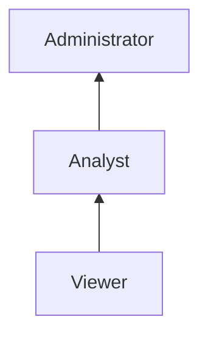
```mermaid
flowchart BT
    V["Viewer"] --> A["Analyst"]
    A --> AD["Administrator"]
```

An administrator can perform every analyst action, and an analyst can perform
every viewer action. The backend enforces this hierarchy with
`role_at_least()`; the frontend uses the same rule to hide unavailable controls.

---

## 4.2 Use-case diagram

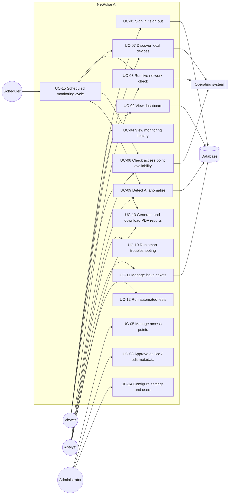
```mermaid
flowchart LR
    V((Viewer))
    A((Analyst))
    AD((Administrator))
    SCH((Scheduler))
    OS[["Operating system"]]
    DB[("Database")]

    subgraph SYS["NetPulse AI"]
        UC01["UC-01 Sign in / sign out"]
        UC02["UC-02 View dashboard"]
        UC03["UC-03 Run live network check"]
        UC04["UC-04 View monitoring history"]
        UC05["UC-05 Manage access points"]
        UC06["UC-06 Check access point availability"]
        UC07["UC-07 Discover local devices"]
        UC08["UC-08 Approve device / edit metadata"]
        UC09["UC-09 Detect AI anomalies"]
        UC10["UC-10 Run smart troubleshooting"]
        UC11["UC-11 Manage issue tickets"]
        UC12["UC-12 Run automated tests"]
        UC13["UC-13 Generate and download PDF reports"]
        UC14["UC-14 Configure settings and users"]
        UC15["UC-15 Scheduled monitoring cycle"]
    end

    V --> UC01
    V --> UC02
    V --> UC04
    V --> UC07
    V --> UC13

    A --> UC03
    A --> UC06
    A --> UC09
    A --> UC10
    A --> UC11
    A --> UC12
    A --> UC13

    AD --> UC05
    AD --> UC08
    AD --> UC14

    SCH --> UC15
    UC15 --> UC03
    UC15 --> UC07
    UC15 --> UC06
    UC15 --> UC09

    UC03 --> OS
    UC06 --> OS
    UC07 --> OS
    UC01 --> DB
    UC02 --> DB
    UC09 --> DB
    UC11 --> DB
```

### 4.2.1 Use-case summary

| ID | Use case | Primary actor | Trigger | Result |
|---|---|---|---|---|
| UC-01 | Sign in / sign out | Any user | Credentials | JWT session or cleared session |
| UC-02 | View dashboard | Viewer+ | Page load / poll | Health index, series, alerts |
| UC-03 | Run live network check | Analyst+ | Button or scheduler | New live measurement |
| UC-04 | View monitoring history | Viewer+ | Page load | Measurement history and scheduler state |
| UC-05 | Manage access points | Admin | CRUD action | Inventory change + audit entry |
| UC-06 | Check AP availability | Analyst+ | Button or scheduler | Live/simulated AP observation |
| UC-07 | Discover local devices | Viewer+ (read) | Button or scheduler | ARP observations, hashed identity |
| UC-08 | Approve device / edit metadata | Admin | Approval/edit | Approved device with display metadata |
| UC-09 | Detect AI anomalies | Analyst+ or scheduler | Button/cycle | Anomaly events with explanations |
| UC-10 | Run smart troubleshooting | Analyst+ | Button | Recommendation with causes and steps |
| UC-11 | Manage issue tickets | Analyst+ | Automatic rule or manual action | Ticket with workflow state and comments |
| UC-12 | Run automated tests | Analyst+ | Button | Persisted JUnit results |
| UC-13 | Generate and download PDF reports | Analyst+ / Viewer+ | Generate/download | PDF in report library |
| UC-14 | Configure settings and users | Admin | Save/create | Updated runtime configuration/user |
| UC-15 | Scheduled monitoring cycle | Scheduler | Timer | Measurement + optional anomaly/ticket |

### 4.2.2 Use-case specifications

#### UC-01 — Sign in

| Field | Detail |
|---|---|
| Actors | Viewer, Analyst, Administrator |
| Preconditions | Backend and database available; user account exists and is active |
| Main flow | 1. User opens `/login`. 2. Enters email and password. 3. Frontend posts `/api/auth/login`. 4. Backend verifies Argon2 hash. 5. Backend returns JWT and profile. 6. Frontend stores token and redirects to `/`. |
| Alternative flows | Unknown email or wrong password → 401 “Invalid email or password”. Disabled account → 403. Eight failures in five minutes → 429 throttle. |
| Postconditions | Valid session in browser; `last_login_at` updated |
| Security | Dummy hash verification for unknown emails; token expiry; no password logging |

#### UC-03 — Run live network check

| Field | Detail |
|---|---|
| Actors | Analyst, Administrator, Scheduler |
| Preconditions | Monitoring enabled; probe target reachable or failure to be recorded |
| Main flow | 1. Request reaches `POST /api/monitoring/run`. 2. Service executes OS ping. 3. Parser extracts replies, loss and jitter. 4. Measurement is saved with `data_origin='live'`. 5. Ticket rules are evaluated. 6. Optional AI detection runs. 7. API returns measurement summary. |
| Alternative flows | No replies → offline measurement, 100% loss, error text. Timeout → offline with timeout text. Ping missing → genuine TCP fallback, labelled. Testing environment → 409 to prevent live probes. |
| Postconditions | One new measurement; possible ticket/anomaly |
| Integrity | No generated values; failure is stored as failure |

#### UC-05 — Register an access point

| Field | Detail |
|---|---|
| Actors | Administrator |
| Preconditions | Signed in as admin |
| Main flow | 1. Open Access Points. 2. Select “Add access point”. 3. Enter name, location, management IP, optional MAC/vendor/model/notes, simulation flag. 4. Submit. 5. Backend validates uniqueness and formats. 6. AP row and `created` history entry are written. |
| Alternative flows | Duplicate name/IP → 409. Invalid IP/MAC → 422. Analyst/viewer → 403. |
| Postconditions | AP visible in inventory with `unknown` status (or `simulated`) |
| Audit | History entry records creator, timestamp and fields |

#### UC-07 — Discover local devices

| Field | Detail |
|---|---|
| Actors | Viewer+ (trigger), Scheduler |
| Preconditions | Active local IPv4 subnet; `arp` command available |
| Main flow | 1. Enumerate local subnets. 2. Run `arp -a`. 3. Parse IP/MAC pairs. 4. Filter own/loopback/link-local/network/broadcast/out-of-subnet. 5. Hash MAC, mask display. 6. Insert/update device and append activity. |
| Alternative flows | No subnet → explanatory message. ARP unavailable → empty result, warning logged. |
| Postconditions | Devices and observation timestamps updated |
| Privacy | No active scan, no packet capture, no raw MAC storage |

#### UC-09 — Detect AI anomalies

| Field | Detail |
|---|---|
| Actors | Analyst+, Scheduler |
| Preconditions | Detection enabled; live measurements exist |
| Main flow | 1. Load recent live measurements. 2. Train Isolation Forest on real history or disclosed synthetic baseline. 3. Score recent measurements. 4. Store new events with severity, robust-z explanation and provenance. 5. Escalate High/Critical events to tickets. |
| Alternative flows | No live data → `no_live_data`. Detection disabled → `disabled`. Existing event → skipped. |
| Postconditions | Zero or more anomaly events; possible AI tickets |
| Explainability | Each event states which metrics contributed and warns that it is not a prediction |

#### UC-10 — Run smart troubleshooting

| Field | Detail |
|---|---|
| Actors | Analyst+ |
| Preconditions | Signed in; optional AP selection |
| Main flow | 1. Open Smart Troubleshooting. 2. Optionally select an AP. 3. Run diagnosis. 4. Engine inspects latest live measurement and thresholds. 5. Recommendation is saved and returned. |
| Alternative flows | Simulated AP → `simulated_access_point` guidance. No live data → `insufficient_data` steps. AP offline → `ap_unavailable`. Loss/latency above threshold → corresponding recommendation. Healthy → `no_issue_detected`. |
| Postconditions | Recommendation with causes, steps, related tickets and safety note |
| Safety | No configuration change; constant advisory note |

#### UC-11 — Manage an issue ticket

| Field | Detail |
|---|---|
| Actors | Analyst+ |
| Preconditions | Ticket exists or manual creation requested |
| Main flow | 1. Open Issue Management. 2. Select a ticket or create one. 3. Update status/priority. 4. Add a comment. 5. Backend persists changes. 6. UI refreshes statistics and row state. |
| Alternative flows | Ticket not found → 404. Viewer → 403. |
| Postconditions | Updated ticket; `resolved_at` set when status becomes Resolved; comment recorded |
| Duplicate rule | Automatic tickets reuse an active ticket with the same fingerprint |

#### UC-13 — Generate and download a PDF report

| Field | Detail |
|---|---|
| Actors | Analyst+ (generate), Viewer+ (download) |
| Preconditions | Signed in; report data available |
| Main flow | 1. Choose report type and window. 2. Generate. 3. Backend builds PDF with ReportLab. 4. Saved under `reports/`. 5. Metadata returned. 6. User downloads through authenticated endpoint. |
| Alternative flows | Invalid type → 400. Unknown filename/path traversal → 400/404. Empty scope → report with no-data notes. |
| Postconditions | PDF file and report metadata |
| Types | Executive, uptime, latency, packet loss, access points, anomalies, issues, testing |

#### UC-14 — Configure settings and users

| Field | Detail |
|---|---|
| Actors | Administrator |
| Preconditions | Signed in as admin |
| Main flow | 1. Open Settings. 2. Edit thresholds, toggles, organization, theme. 3. Save. 4. Backend updates `app_settings`. 5. Create user through the team access dialog. |
| Alternative flows | Non-admin save attempted → 403 (UI read-only). Invalid threshold → 422. Duplicate email → 409. |
| Postconditions | Runtime settings updated; new user can sign in |
| Guardrail | “Automatic configuration changes” is permanently disabled |

#### UC-15 — Scheduled monitoring cycle

| Field | Detail |
|---|---|
| Actors | Scheduler |
| Preconditions | Monitoring enabled in configuration |
| Main flow | 1. Startup runs an initial cycle after one second. 2. Loop waits for the configured interval. 3. A cycle acquires a lock. 4. Live probe + ticket rules + optional AI. 5. Device discovery every five minutes. 6. Real AP checks every five minutes. 7. Timestamps updated. |
| Alternative flows | Overlap → skipped. Exception → recorded in `last_error`, loop continues. |
| Postconditions | Fresh live measurement and periodic auxiliary observations |
| Reliability | Exceptions never terminate the loop |

---

## 4.3 Class model

The class diagram shows the principal domain entities and the service classes
that operate on them. Getters/setters are omitted for readability; SQLAlchemy
provides persistence mapping.

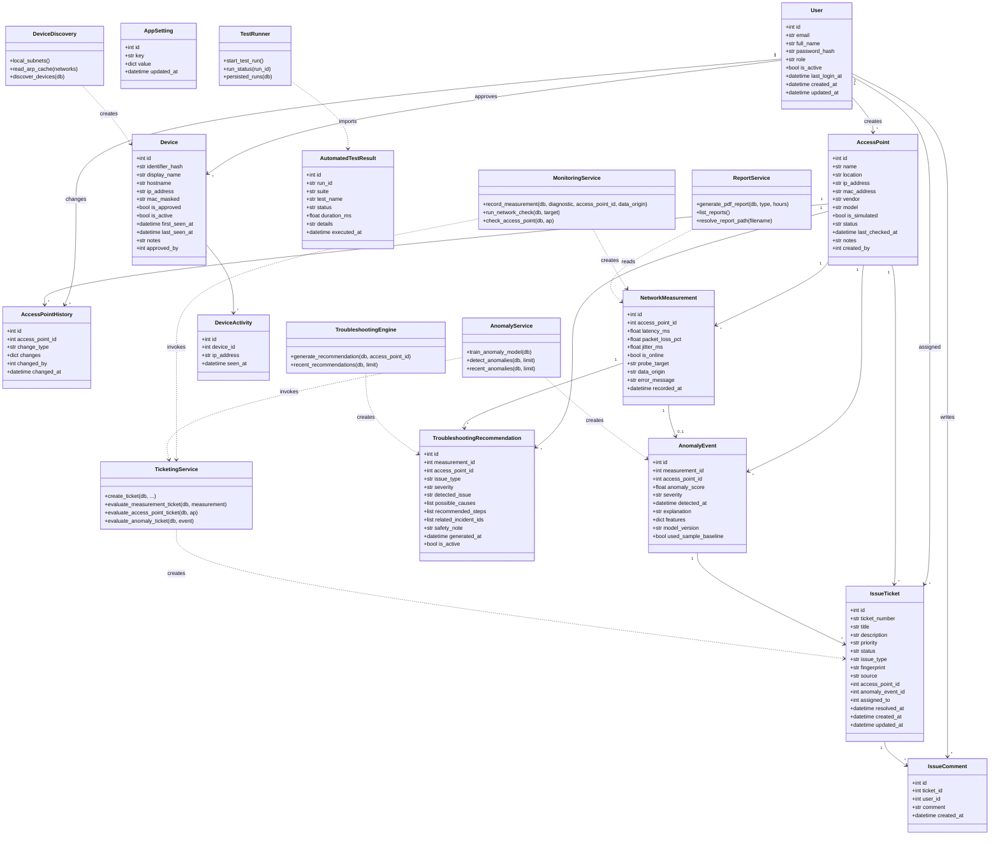
```mermaid
classDiagram
    class User {
        +int id
        +str email
        +str full_name
        +str password_hash
        +str role
        +bool is_active
        +datetime last_login_at
        +datetime created_at
        +datetime updated_at
    }

    class AccessPoint {
        +int id
        +str name
        +str location
        +str ip_address
        +str mac_address
        +str vendor
        +str model
        +bool is_simulated
        +str status
        +datetime last_checked_at
        +str notes
        +int created_by
    }

    class AccessPointHistory {
        +int id
        +int access_point_id
        +str change_type
        +dict changes
        +int changed_by
        +datetime changed_at
    }

    class NetworkMeasurement {
        +int id
        +int access_point_id
        +float latency_ms
        +float packet_loss_pct
        +float jitter_ms
        +bool is_online
        +str probe_target
        +str data_origin
        +str error_message
        +datetime recorded_at
    }

    class AnomalyEvent {
        +int id
        +int measurement_id
        +int access_point_id
        +float anomaly_score
        +str severity
        +datetime detected_at
        +str explanation
        +dict features
        +str model_version
        +bool used_sample_baseline
    }

    class TroubleshootingRecommendation {
        +int id
        +int measurement_id
        +int access_point_id
        +str issue_type
        +str severity
        +str detected_issue
        +list possible_causes
        +list recommended_steps
        +list related_incident_ids
        +str safety_note
        +datetime generated_at
        +bool is_active
    }

    class Device {
        +int id
        +str identifier_hash
        +str display_name
        +str hostname
        +str ip_address
        +str mac_masked
        +bool is_approved
        +bool is_active
        +datetime first_seen_at
        +datetime last_seen_at
        +str notes
        +int approved_by
    }

    class DeviceActivity {
        +int id
        +int device_id
        +str ip_address
        +datetime seen_at
    }

    class IssueTicket {
        +int id
        +str ticket_number
        +str title
        +str description
        +str priority
        +str status
        +str issue_type
        +str fingerprint
        +str source
        +int access_point_id
        +int anomaly_event_id
        +int assigned_to
        +datetime resolved_at
        +datetime created_at
        +datetime updated_at
    }

    class IssueComment {
        +int id
        +int ticket_id
        +int user_id
        +str comment
        +datetime created_at
    }

    class AutomatedTestResult {
        +int id
        +str run_id
        +str suite
        +str test_name
        +str status
        +float duration_ms
        +str details
        +datetime executed_at
    }

    class AppSetting {
        +int id
        +str key
        +dict value
        +datetime updated_at
    }

    class MonitoringService {
        +record_measurement(db, diagnostic, access_point_id, data_origin)
        +run_network_check(db, target)
        +check_access_point(db, ap)
    }

    class AnomalyService {
        +train_anomaly_model(db)
        +detect_anomalies(db, limit)
        +recent_anomalies(db, limit)
    }

    class TicketingService {
        +create_ticket(db, ...)
        +evaluate_measurement_ticket(db, measurement)
        +evaluate_access_point_ticket(db, ap)
        +evaluate_anomaly_ticket(db, event)
    }

    class TroubleshootingEngine {
        +generate_recommendation(db, access_point_id)
        +recent_recommendations(db, limit)
    }

    class ReportService {
        +generate_pdf_report(db, type, hours)
        +list_reports()
        +resolve_report_path(filename)
    }

    class DeviceDiscovery {
        +local_subnets()
        +read_arp_cache(networks)
        +discover_devices(db)
    }

    class TestRunner {
        +start_test_run()
        +run_status(run_id)
        +persisted_runs(db)
    }

    User "1" --> "*" AccessPoint : creates
    User "1" --> "*" AccessPointHistory : changes
    User "1" --> "*" Device : approves
    User "1" --> "*" IssueTicket : assigned
    User "1" --> "*" IssueComment : writes

    AccessPoint "1" --> "*" AccessPointHistory
    AccessPoint "1" --> "*" NetworkMeasurement
    AccessPoint "1" --> "*" AnomalyEvent
    AccessPoint "1" --> "*" TroubleshootingRecommendation
    AccessPoint "1" --> "*" IssueTicket

    Device "1" --> "*" DeviceActivity
    NetworkMeasurement "1" --> "0..1" AnomalyEvent
    NetworkMeasurement "1" --> "*" TroubleshootingRecommendation
    AnomalyEvent "1" --> "*" IssueTicket
    IssueTicket "1" --> "*" IssueComment

    MonitoringService ..> NetworkMeasurement : creates
    MonitoringService ..> TicketingService : invokes
    AnomalyService ..> AnomalyEvent : creates
    AnomalyService ..> TicketingService : invokes
    TicketingService ..> IssueTicket : creates
    TroubleshootingEngine ..> TroubleshootingRecommendation : creates
    ReportService ..> NetworkMeasurement : reads
    DeviceDiscovery ..> Device : creates
    TestRunner ..> AutomatedTestResult : imports
```

### 4.3.1 Class responsibilities

| Class | Responsibility | Key collaborators |
|---|---|---|
| `User` | Identity, role, active state | Auth API, role dependencies |
| `AccessPoint` | Authorized inventory and health state | AP API, monitoring service |
| `NetworkMeasurement` | Immutable observation | Dashboard, AI, reporting |
| `AnomalyEvent` | Explainable statistical finding | Ticket service, dashboard |
| `TroubleshootingRecommendation` | Advisory diagnosis | Troubleshooting API |
| `Device` / `DeviceActivity` | Privacy-preserving local inventory | Discovery service |
| `IssueTicket` / `IssueComment` | Incident workflow and audit trail | Ticket service, reports |
| `AutomatedTestResult` | Verification evidence | Test runner |
| `AppSetting` | Runtime configuration | Settings service |
| `MonitoringService` | Orchestrates probes and persistence | Diagnostics, ticketing |
| `AnomalyService` | Trains, scores and explains | scikit-learn, settings |
| `TicketingService` | Applies thresholds and deduplication | Models |
| `TroubleshootingEngine` | Rule-based diagnosis | Measurements, settings |
| `ReportService` | Builds PDFs | ReportLab |
| `DeviceDiscovery` | ARP parsing and privacy transforms | psutil, hashlib |
| `TestRunner` | Fixed test execution and JUnit import | pytest, filesystem |

---

## 4.4 Sequence diagrams

### 4.4.1 Login and session restore

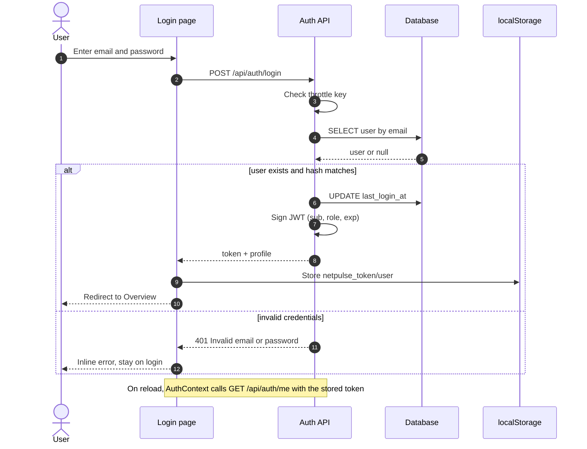
```mermaid
sequenceDiagram
    autonumber
    actor U as User
    participant UI as Login page
    participant API as Auth API
    participant DB as Database
    participant LS as localStorage

    U->>UI: Enter email and password
    UI->>API: POST /api/auth/login
    API->>API: Check throttle key
    API->>DB: SELECT user by email
    DB-->>API: user or null
    alt user exists and hash matches
        API->>DB: UPDATE last_login_at
        API->>API: Sign JWT (sub, role, exp)
        API-->>UI: token + profile
        UI->>LS: Store netpulse_token/user
        UI-->>U: Redirect to Overview
    else invalid credentials
        API-->>UI: 401 Invalid email or password
        UI-->>U: Inline error, stay on login
    end

    Note over UI,API: On reload, AuthContext calls GET /api/auth/me with the stored token
```

### 4.4.2 Scheduled live check with AI and ticket escalation

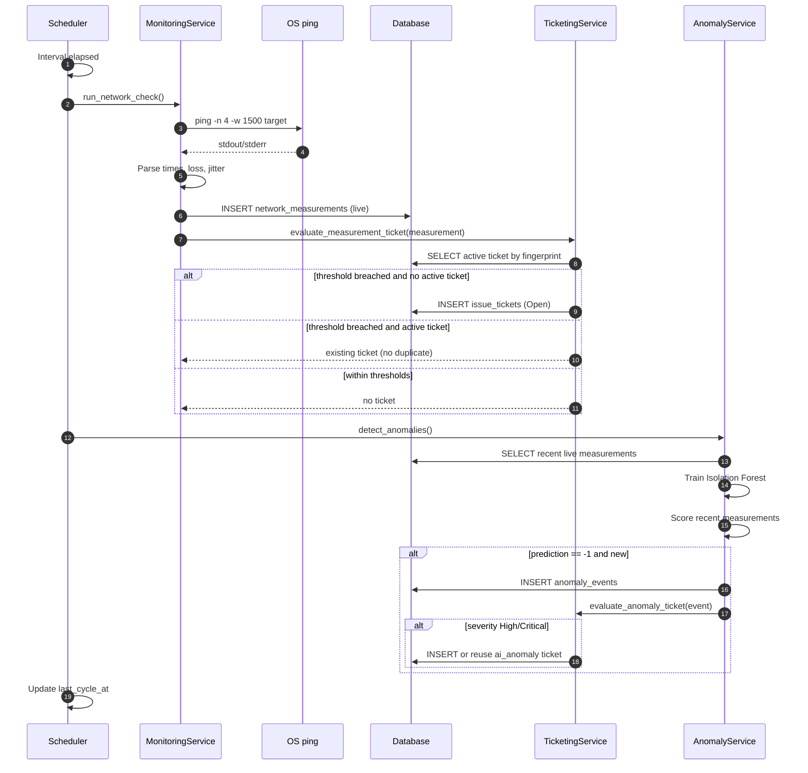
```mermaid
sequenceDiagram
    autonumber
    participant S as Scheduler
    participant MS as MonitoringService
    participant OS as OS ping
    participant DB as Database
    participant TS as TicketingService
    participant AI as AnomalyService

    S->>S: Interval elapsed
    S->>MS: run_network_check()
    MS->>OS: ping -n 4 -w 1500 target
    OS-->>MS: stdout/stderr
    MS->>MS: Parse times, loss, jitter
    MS->>DB: INSERT network_measurements (live)
    MS->>TS: evaluate_measurement_ticket(measurement)
    TS->>DB: SELECT active ticket by fingerprint
    alt threshold breached and no active ticket
        TS->>DB: INSERT issue_tickets (Open)
    else threshold breached and active ticket
        TS-->>MS: existing ticket (no duplicate)
    else within thresholds
        TS-->>MS: no ticket
    end
    S->>AI: detect_anomalies()
    AI->>DB: SELECT recent live measurements
    AI->>AI: Train Isolation Forest
    AI->>AI: Score recent measurements
    alt prediction == -1 and new
        AI->>DB: INSERT anomaly_events
        AI->>TS: evaluate_anomaly_ticket(event)
        alt severity High/Critical
            TS->>DB: INSERT or reuse ai_anomaly ticket
        end
    end
    S->>S: Update last_cycle_at
```

### 4.4.3 Access point availability check

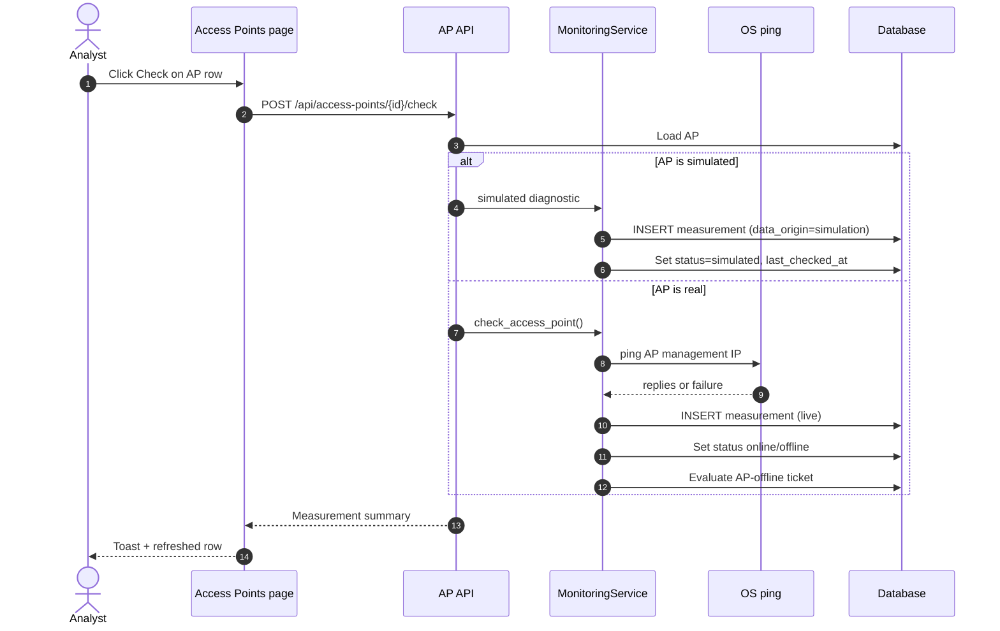
```mermaid
sequenceDiagram
    autonumber
    actor A as Analyst
    participant UI as Access Points page
    participant API as AP API
    participant MS as MonitoringService
    participant OS as OS ping
    participant DB as Database

    A->>UI: Click Check on AP row
    UI->>API: POST /api/access-points/{id}/check
    API->>DB: Load AP
    alt AP is simulated
        API->>MS: simulated diagnostic
        MS->>DB: INSERT measurement (data_origin=simulation)
        MS->>DB: Set status=simulated, last_checked_at
    else AP is real
        API->>MS: check_access_point()
        MS->>OS: ping AP management IP
        OS-->>MS: replies or failure
        MS->>DB: INSERT measurement (live)
        MS->>DB: Set status online/offline
        MS->>DB: Evaluate AP-offline ticket
    end
    API-->>UI: Measurement summary
    UI-->>A: Toast + refreshed row
```

### 4.4.4 Manual ticket and comment

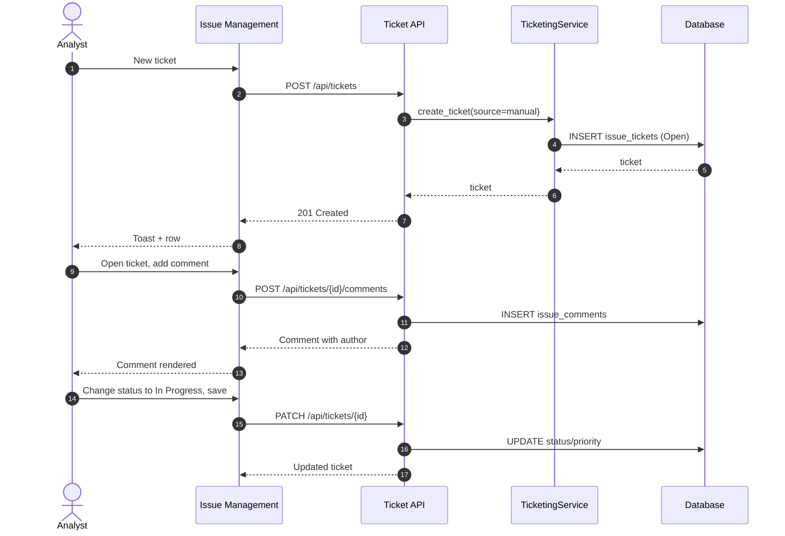
```mermaid
sequenceDiagram
    autonumber
    actor A as Analyst
    participant UI as Issue Management
    participant API as Ticket API
    participant TS as TicketingService
    participant DB as Database

    A->>UI: New ticket
    UI->>API: POST /api/tickets
    API->>TS: create_ticket(source=manual)
    TS->>DB: INSERT issue_tickets (Open)
    DB-->>TS: ticket
    TS-->>API: ticket
    API-->>UI: 201 Created
    UI-->>A: Toast + row

    A->>UI: Open ticket, add comment
    UI->>API: POST /api/tickets/{id}/comments
    API->>DB: INSERT issue_comments
    API-->>UI: Comment with author
    UI-->>A: Comment rendered

    A->>UI: Change status to In Progress, save
    UI->>API: PATCH /api/tickets/{id}
    API->>DB: UPDATE status/priority
    API-->>UI: Updated ticket
```

### 4.4.5 PDF report generation and download

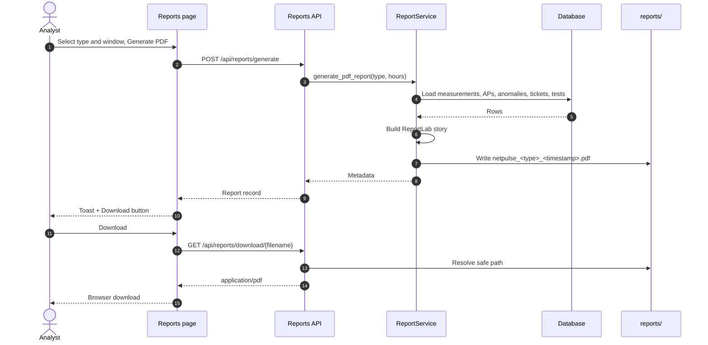
```mermaid
sequenceDiagram
    autonumber
    actor A as Analyst
    participant UI as Reports page
    participant API as Reports API
    participant RS as ReportService
    participant DB as Database
    participant FS as reports/

    A->>UI: Select type and window, Generate PDF
    UI->>API: POST /api/reports/generate
    API->>RS: generate_pdf_report(type, hours)
    RS->>DB: Load measurements, APs, anomalies, tickets, tests
    DB-->>RS: Rows
    RS->>RS: Build ReportLab story
    RS->>FS: Write netpulse_<type>_<timestamp>.pdf
    RS-->>API: Metadata
    API-->>UI: Report record
    UI-->>A: Toast + Download button

    A->>UI: Download
    UI->>API: GET /api/reports/download/{filename}
    API->>FS: Resolve safe path
    API-->>UI: application/pdf
    UI-->>A: Browser download
```

### 4.4.6 Built-in automated test run

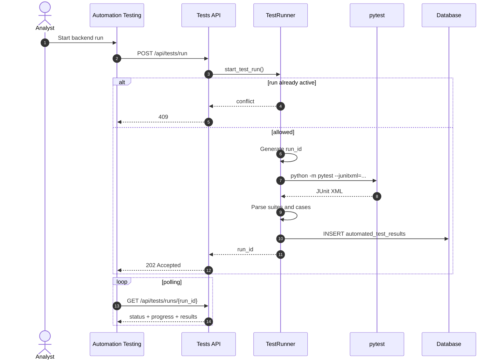
```mermaid
sequenceDiagram
    autonumber
    actor A as Analyst
    participant UI as Automation Testing
    participant API as Tests API
    participant TR as TestRunner
    participant PY as pytest
    participant DB as Database

    A->>UI: Start backend run
    UI->>API: POST /api/tests/run
    API->>TR: start_test_run()
    alt run already active
        TR-->>API: conflict
        API-->>UI: 409
    else allowed
        TR->>TR: Generate run_id
        TR->>PY: python -m pytest --junitxml=...
        PY-->>TR: JUnit XML
        TR->>TR: Parse suites and cases
        TR->>DB: INSERT automated_test_results
        TR-->>API: run_id
        API-->>UI: 202 Accepted
    end
    loop polling
        UI->>API: GET /api/tests/runs/{run_id}
        API-->>UI: status + progress + results
    end
```

### 4.4.7 Device discovery

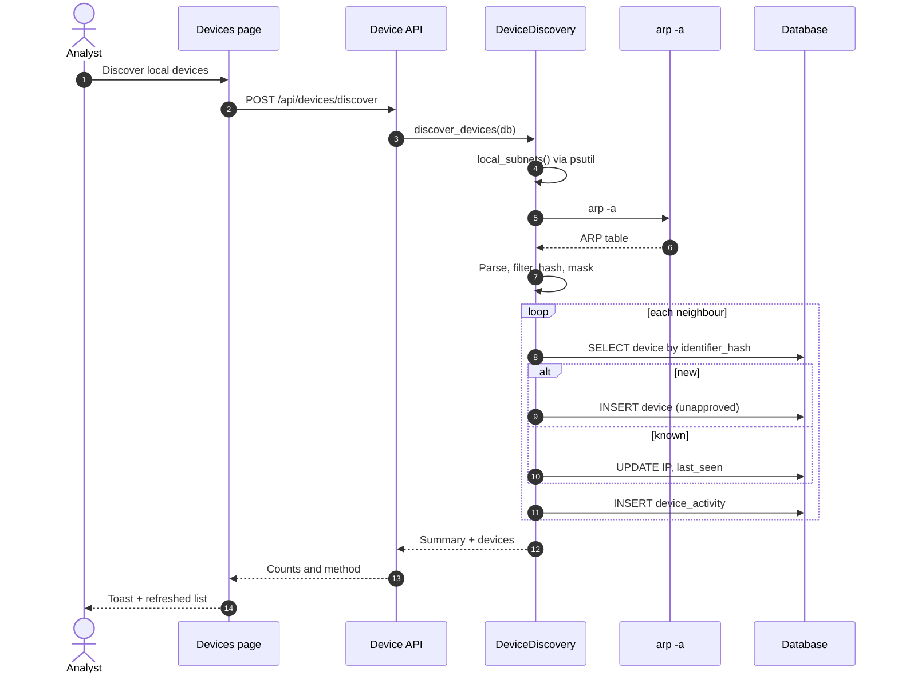
```mermaid
sequenceDiagram
    autonumber
    actor A as Analyst
    participant UI as Devices page
    participant API as Device API
    participant DD as DeviceDiscovery
    participant OS as arp -a
    participant DB as Database

    A->>UI: Discover local devices
    UI->>API: POST /api/devices/discover
    API->>DD: discover_devices(db)
    DD->>DD: local_subnets() via psutil
    DD->>OS: arp -a
    OS-->>DD: ARP table
    DD->>DD: Parse, filter, hash, mask
    loop each neighbour
        DD->>DB: SELECT device by identifier_hash
        alt new
            DD->>DB: INSERT device (unapproved)
        else known
            DD->>DB: UPDATE IP, last_seen
        end
        DD->>DB: INSERT device_activity
    end
    DD-->>API: Summary + devices
    API-->>UI: Counts and method
    UI-->>A: Toast + refreshed list
```

---

## 4.5 Activity diagrams

### 4.5.1 User authentication and authorization

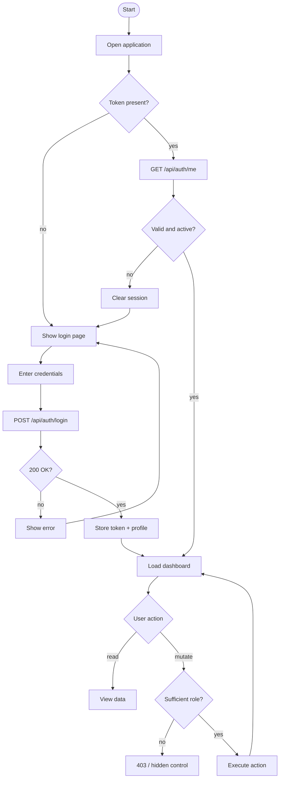
```mermaid
flowchart TD
    START([Start]) --> OPEN[Open application]
    OPEN --> TOKEN{Token present?}
    TOKEN -->|"no"| LOGIN[Show login page]
    TOKEN -->|"yes"| ME[GET /api/auth/me]
    ME --> VALID{Valid and active?}
    VALID -->|"no"| CLEAR[Clear session] --> LOGIN
    VALID -->|"yes"| DASH[Load dashboard]
    LOGIN --> CREDS[Enter credentials]
    CREDS --> POST[POST /api/auth/login]
    POST --> OK{200 OK?}
    OK -->|"no"| ERROR[Show error] --> LOGIN
    OK -->|"yes"| STORE[Store token + profile] --> DASH
    DASH --> ACTION{User action}
    ACTION -->|"read"| VIEW[View data]
    ACTION -->|"mutate"| ROLE{Sufficient role?}
    ROLE -->|"no"| FORBID[403 / hidden control]
    ROLE -->|"yes"| EXEC[Execute action]
    EXEC --> DASH
```

### 4.5.2 Monitoring cycle

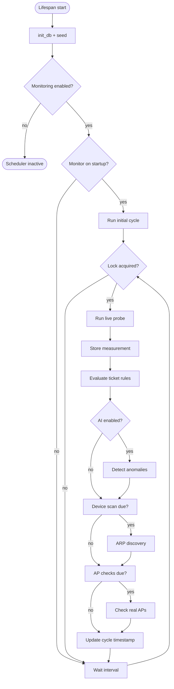
```mermaid
flowchart TD
    START([Lifespan start]) --> DB[init_db + seed]
    DB --> EN{Monitoring enabled?}
    EN -->|"no"| IDLE([Scheduler inactive])
    EN -->|"yes"| INITIAL{Monitor on startup?}
    INITIAL -->|"yes"| CYCLE[Run initial cycle]
    INITIAL -->|"no"| WAIT[Wait interval]
    CYCLE --> LOCK{Lock acquired?}
    WAIT --> LOCK
    LOCK -->|"no"| WAIT
    LOCK -->|"yes"| PROBE[Run live probe]
    PROBE --> STORE[Store measurement]
    STORE --> RULES[Evaluate ticket rules]
    RULES --> AI{AI enabled?}
    AI -->|"yes"| DETECT[Detect anomalies]
    AI -->|"no"| AUX
    DETECT --> AUX[Device scan due?]
    AUX -->|"yes"| DISCOVER[ARP discovery]
    AUX -->|"no"| APS
    DISCOVER --> APS[AP checks due?]
    APS -->|"yes"| CHECK[Check real APs]
    APS -->|"no"| STAMP[Update cycle timestamp]
    CHECK --> STAMP
    STAMP --> WAIT
```

### 4.5.3 Ticket lifecycle

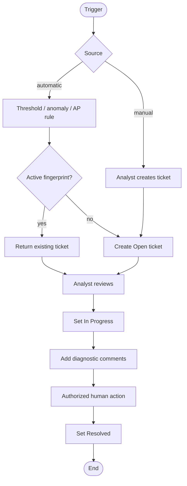
```mermaid
flowchart TD
    START([Trigger]) --> AUTO{Source}
    AUTO -->|"automatic"| RULE[Threshold / anomaly / AP rule]
    AUTO -->|"manual"| FORM[Analyst creates ticket]
    RULE --> FP{Active fingerprint?}
    FP -->|"yes"| REUSE[Return existing ticket]
    FP -->|"no"| CREATE[Create Open ticket]
    FORM --> CREATE
    CREATE --> TRIAGE[Analyst reviews]
    TRIAGE --> PROG[Set In Progress]
    PROG --> COMMENT[Add diagnostic comments]
    COMMENT --> FIX[Authorized human action]
    FIX --> RESOLVE[Set Resolved]
    RESOLVE --> END([End])
    REUSE --> TRIAGE
```

### 4.5.4 Report generation

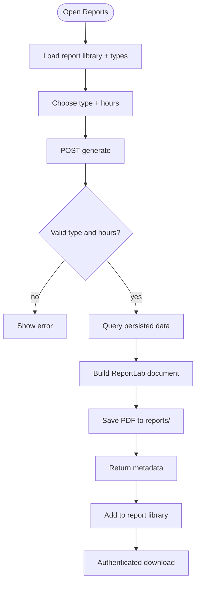
```mermaid
flowchart TD
    START([Open Reports]) --> LOAD[Load report library + types]
    LOAD --> CHOOSE[Choose type + hours]
    CHOOSE --> GEN[POST generate]
    GEN --> VALID{Valid type and hours?}
    VALID -->|"no"| ERR[Show error]
    VALID -->|"yes"| QUERY[Query persisted data]
    QUERY --> BUILD[Build ReportLab document]
    BUILD --> SAVE[Save PDF to reports/]
    SAVE --> META[Return metadata]
    META --> LIST[Add to report library]
    LIST --> DOWNLOAD[Authenticated download]
```

---

## 4.6 State models

### 4.6.1 Access point state

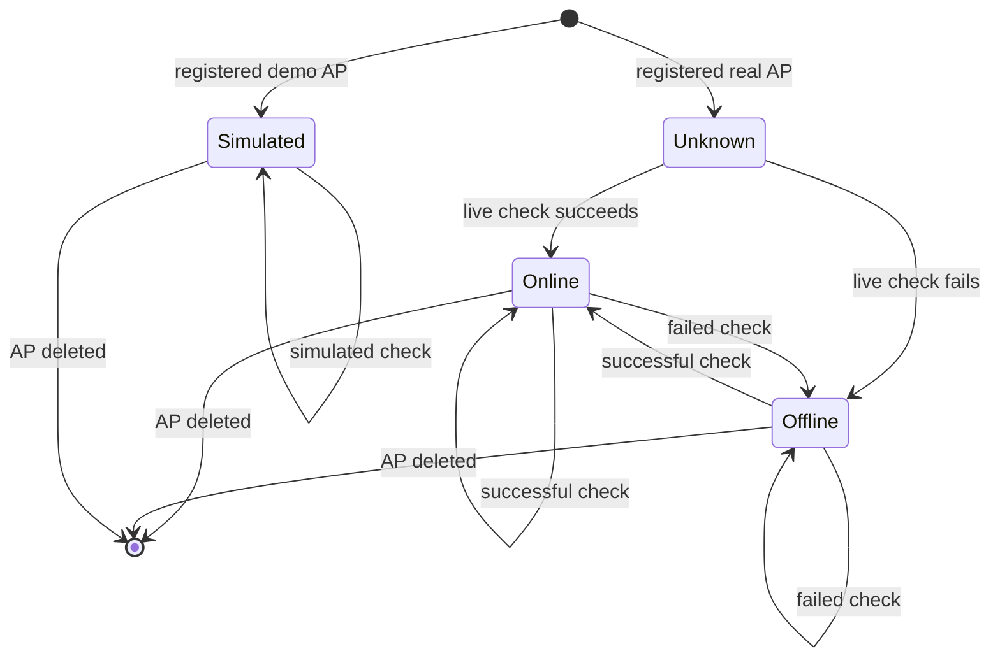
```mermaid
stateDiagram-v2
    [*] --> Unknown: registered real AP
    [*] --> Simulated: registered demo AP
    Unknown --> Online: live check succeeds
    Unknown --> Offline: live check fails
    Online --> Online: successful check
    Online --> Offline: failed check
    Offline --> Online: successful check
    Offline --> Offline: failed check
    Simulated --> Simulated: simulated check
    Online --> [*]: AP deleted
    Offline --> [*]: AP deleted
    Simulated --> [*]: AP deleted
```

`status` is stored as a string. A real AP starts as `unknown` and moves to
`online` or `offline` after a check. A simulated AP remains `simulated` and is
excluded from health calculations.

### 4.6.2 Ticket state

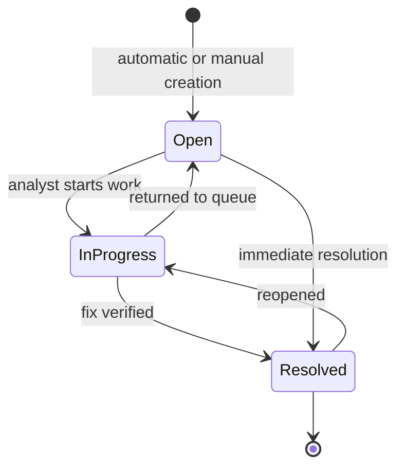
```mermaid
stateDiagram-v2
    [*] --> Open: automatic or manual creation
    Open --> InProgress: analyst starts work
    InProgress --> Resolved: fix verified
    Open --> Resolved: immediate resolution
    InProgress --> Open: returned to queue
    Resolved --> InProgress: reopened
    Resolved --> [*]
```

The UI exposes statuses `Open`, `In Progress` and `Resolved`. The API
sets `resolved_at` when the status becomes `Resolved` and clears it otherwise.
The intended workflow is shown above; the API does not enforce a strict
transition graph, which allows an administrator to correct mistakes.

### 4.6.3 Device approval state

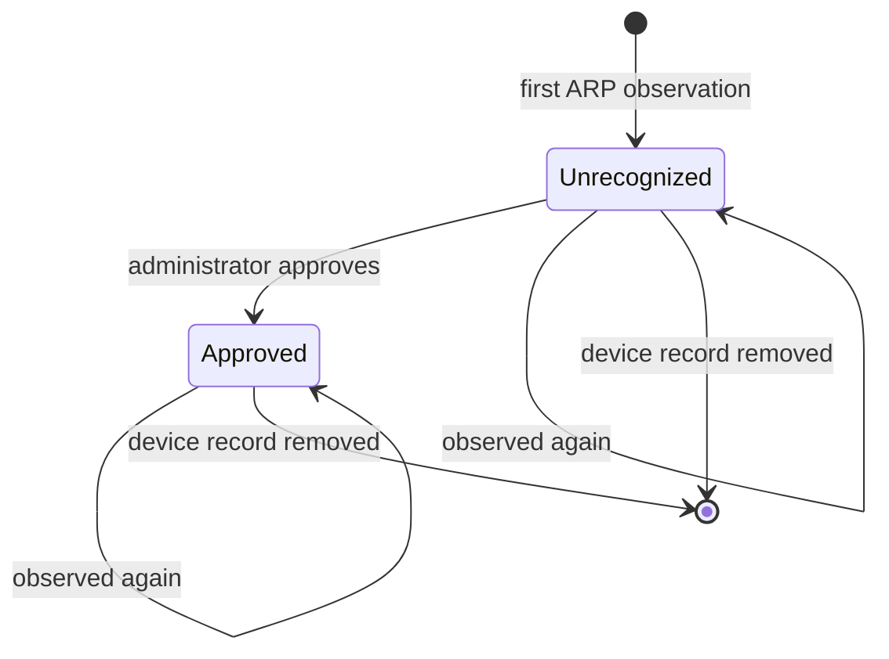
```mermaid
stateDiagram-v2
    [*] --> Unrecognized: first ARP observation
    Unrecognized --> Approved: administrator approves
    Approved --> Approved: observed again
    Unrecognized --> Unrecognized: observed again
    Approved --> [*]: device record removed
    Unrecognized --> [*]: device record removed
```

Device identity is stable through the hashed MAC. An approved device remains
approved when its IP changes; `last_seen_at` and `is_active` update on discovery.

### 4.6.4 Service health state

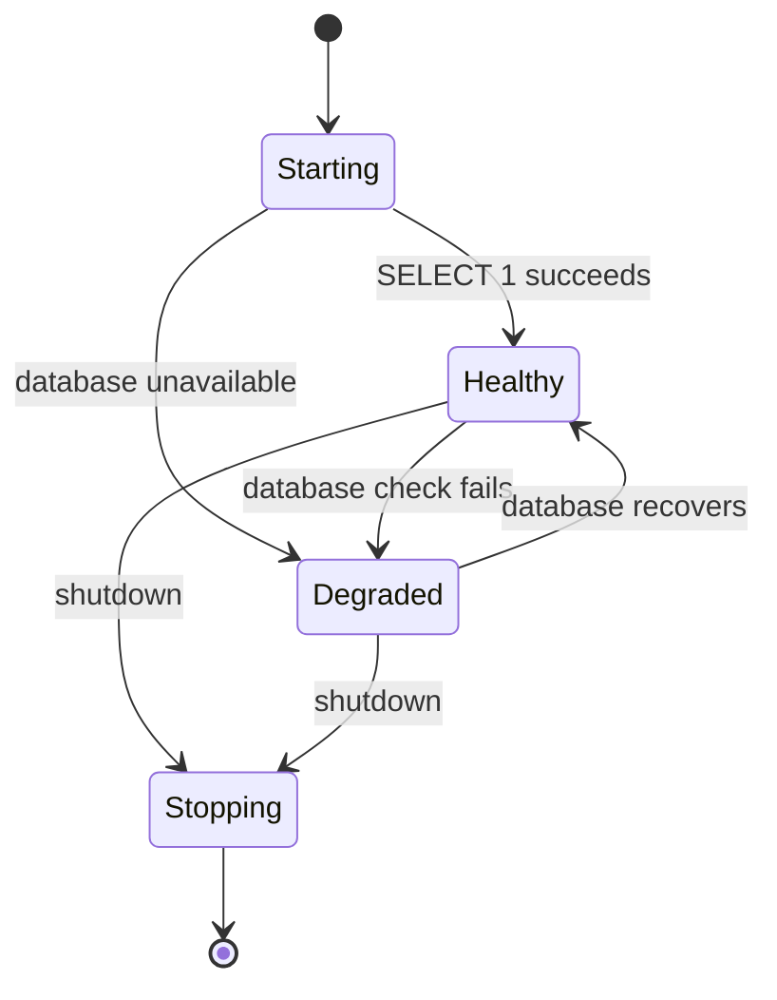
```mermaid
stateDiagram-v2
    [*] --> Starting
    Starting --> Healthy: SELECT 1 succeeds
    Starting --> Degraded: database unavailable
    Healthy --> Degraded: database check fails
    Degraded --> Healthy: database recovers
    Healthy --> Stopping: shutdown
    Degraded --> Stopping: shutdown
    Stopping --> [*]
```

`GET /api/health` returns `status=ok` when the database responds and `degraded`
otherwise. The scheduler status is exposed separately in the dashboard.

---

## 4.7 Data-flow diagrams

### 4.7.1 Level 0 — context diagram

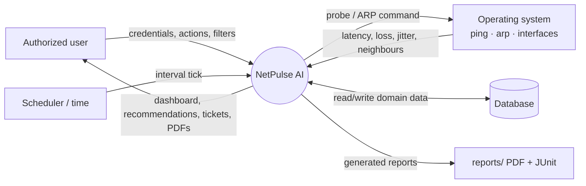
```mermaid
flowchart LR
    USER["Authorized user"]
    SCHED["Scheduler / time"]
    OS["Operating system<br/>ping · arp · interfaces"]
    SYSTEM(("NetPulse AI"))
    DB[("Database")]
    FILES["reports/ PDF + JUnit"]

    USER -->|"credentials, actions, filters"| SYSTEM
    SYSTEM -->|"dashboard, recommendations, tickets, PDFs"| USER
    SCHED -->|"interval tick"| SYSTEM
    SYSTEM -->|"probe / ARP command"| OS
    OS -->|"latency, loss, jitter, neighbours"| SYSTEM
    SYSTEM <-->|"read/write domain data"| DB
    SYSTEM -->|"generated reports"| FILES
```

### 4.7.2 Level 1 — major processes

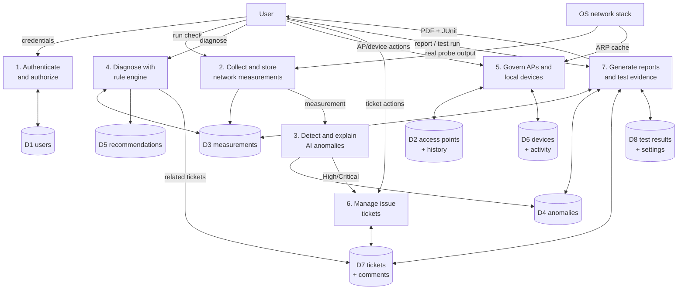
```mermaid
flowchart TB
    USER["User"]
    OS["OS network stack"]
    P1["1. Authenticate<br/>and authorize"]
    P2["2. Collect and store<br/>network measurements"]
    P3["3. Detect and explain<br/>AI anomalies"]
    P4["4. Diagnose with<br/>rule engine"]
    P5["5. Govern APs and<br/>local devices"]
    P6["6. Manage issue<br/>tickets"]
    P7["7. Generate reports<br/>and test evidence"]

    D1[("D1 users")]
    D2[("D2 access points<br/>+ history")]
    D3[("D3 measurements")]
    D4[("D4 anomalies")]
    D5[("D5 recommendations")]
    D6[("D6 devices<br/>+ activity")]
    D7[("D7 tickets<br/>+ comments")]
    D8[("D8 test results<br/>+ settings")]

    USER -->|"credentials"| P1
    P1 <--> D1
    USER -->|"run check"| P2
    OS -->|"real probe output"| P2
    P2 --> D3
    P2 -->|"measurement"| P3
    P3 --> D4
    P3 -->|"High/Critical"| P6
    USER -->|"diagnose"| P4
    P4 <--> D3
    P4 --> D5
    P4 -->|"related tickets"| D7
    USER -->|"AP/device actions"| P5
    P5 <--> D2
    OS -->|"ARP cache"| P5
    P5 <--> D6
    USER -->|"ticket actions"| P6
    P6 <--> D7
    USER -->|"report / test run"| P7
    P7 <--> D3
    P7 <--> D4
    P7 <--> D7
    P7 <--> D8
    P7 -->|"PDF + JUnit"| USER
```

### 4.7.3 Level 2 — monitoring process (P2)

```mermaid
flowchart TD
    TICK["Scheduler tick or<br/>manual request"] --> CFG["Read configuration<br/>target, count, timeout, interval"]
    CFG --> RUN["Execute OS ping"]
    RUN --> OK{"Replies?"}
    OK -->|"yes"| PARSE["Parse times, loss, jitter"]
    OK -->|"no"| FAIL["Build offline observation<br/>loss=100, error text"]
    PARSE --> STORE[("Store measurement<br/>data_origin=live")]
    FAIL --> STORE
    STORE --> THRESH{"Threshold rule<br/>breached?"}
    THRESH -->|"yes"| DUP{"Active ticket with<br/>same fingerprint?"}
    THRESH -->|"no"| AI["Trigger anomaly check"]
    DUP -->|"yes"| REUSE["Reuse ticket"]
    DUP -->|"no"| CREATE["Create ticket"]
    REUSE --> AI
    CREATE --> AI
    AI --> OUT["Return measurement<br/>and status"]
```

### 4.7.4 Level 2 — AI process (P3)

```mermaid
flowchart TD
    IN["Recent live measurements"] --> ENOUGH{"Count >= min samples?"}
    ENOUGH -->|"yes"| REAL["Train on real history"]
    ENOUGH -->|"no"| SYN["Train on labelled<br/>synthetic baseline"]
    REAL --> MODEL["Isolation Forest"]
    SYN --> MODEL
    MODEL --> SCORE["Score recent measurements"]
    SCORE --> OUT{"Prediction -1?"}
    OUT -->|"no"| DONE["No event"]
    OUT -->|"yes"| NEW{"Already stored?"}
    NEW -->|"yes"| DONE
    NEW -->|"no"| Z["Robust z-scores"]
    Z --> SEV["Severity + explanation"]
    SEV --> SAVE[("anomaly_events")]
    SAVE --> ESC{"High/Critical?"}
    ESC -->|"yes"| TICKET[("issue_tickets")]
    ESC -->|"no"| DONE
```

### 4.7.5 Level 2 — device governance (P5)

```mermaid
flowchart TD
    REQ["Discovery request<br/>or 5-minute timer"] --> SUBNET["Enumerate active<br/>IPv4 subnets"]
    SUBNET --> NONE{"Subnet available?"}
    NONE -->|"no"| MSG["Return explanatory message"]
    NONE -->|"yes"| ARP["Execute arp -a"]
    ARP --> PARSE["Parse IP/MAC pairs"]
    PARSE --> FILTER["Filter own, loopback,<br/>link-local, network,<br/>broadcast, out-of-subnet"]
    FILTER --> HASH["SHA-256 identity<br/>+ masked MAC"]
    HASH --> EXISTS{"Device exists?"}
    EXISTS -->|"no"| INSERT["Insert unapproved device"]
    EXISTS -->|"yes"| UPDATE["Update IP + last_seen"]
    INSERT --> ACTIVITY[("device_activity")]
    UPDATE --> ACTIVITY
    ACTIVITY --> RESP["Return counts"]
```

---

## 4.8 Component diagram

```mermaid
flowchart TB
    subgraph Frontend["frontend/src"]
        PAGES["Pages (10 modules)"]
        UI["UI primitives"]
        CTX["Context providers"]
        APIC["Axios API client"]
    end
    subgraph Backend["backend/app"]
        ROUTERS["API routers"]
        SCHEMAS["Pydantic schemas"]
        SERVICES["Domain services"]
        MON["Monitoring adapters"]
        AI["AI + rule engine"]
        MODELS["SQLAlchemy models"]
        CORE["Config, security,<br/>database, logging"]
    end
    subgraph Infra["Local infrastructure"]
        DB[("SQLite / MySQL")]
        FS["reports/"]
        OS["OS ping / arp / psutil"]
    end

    PAGES --> UI
    PAGES --> CTX
    PAGES --> APIC
    APIC -->|"JSON + JWT"| ROUTERS
    ROUTERS --> SCHEMAS
    ROUTERS --> SERVICES
    SERVICES --> MON
    SERVICES --> AI
    SERVICES --> MODELS
    ROUTERS --> CORE
    MODELS --> DB
    MON --> OS
    SERVICES --> FS
```

### 4.8.1 Component interfaces

| Provider | Interface | Consumer |
|---|---|---|
| Auth API | `POST /api/auth/login`, `GET /api/auth/me` | Login page, AuthContext |
| Dashboard API | `GET /api/dashboard/overview` | Overview, header notifications |
| Monitoring API | `GET /api/monitoring/*`, `POST /api/monitoring/run` | Network Monitoring page, dashboard |
| AP API | `/api/access-points/*` | Access Points page |
| Device API | `/api/devices/*` | Connected Devices page |
| Anomaly API | `/api/anomalies/*` | AI page, dashboard |
| Troubleshooting API | `/api/troubleshooting/*` | Troubleshooting page |
| Ticket API | `/api/tickets/*` | Issue Management page |
| Tests API | `/api/tests/*` | Automation Testing page |
| Reports API | `/api/reports/*` | Reports page |
| Settings API | `/api/settings/*` | Settings page |

---

## 4.9 Deployment diagram

```mermaid
flowchart TB
    subgraph Browser["Client device"]
        CHROME["Chrome / Edge browser"]
    end
    subgraph Host["Authorized Windows host"]
        subgraph Dev["Development profile"]
            VITE["Vite dev server<br/>:5173"]
        end
        subgraph Prod["Production-style profile"]
            UV["Uvicorn + FastAPI<br/>:8000"]
            DIST["frontend/dist<br/>static assets"]
        end
        subgraph Data["Local data"]
            SQLITE[("SQLite<br/>backend/data/netpulse.db")]
            REPORTS["reports/<br/>PDF + JUnit + coverage"]
        end
        subgraph Net["Network stack"]
            ICMP["ICMP echo"]
            ARP["ARP cache"]
        end
    end
    subgraph Optional["Optional Docker profile"]
        MYSQL[("MySQL 8.4<br/>:3307")]
        PMA["phpMyAdmin<br/>:8081"]
    end

    CHROME -->|"HTTP :5173"| VITE
    CHROME -->|"HTTP :8000"| UV
    VITE -->|"/api proxy"| UV
    UV --> DIST
    UV --> SQLITE
    UV -.->|"DATABASE_URL"| MYSQL
    UV --> REPORTS
    UV --> ICMP
    UV --> ARP
    PMA --> MYSQL
```

### 4.9.1 Node responsibilities

| Node | Responsibility |
|---|---|
| Browser | Render SPA, store JWT, call API, download PDFs |
| Vite | Development serving, HMR, `/api` proxy |
| Uvicorn/FastAPI | API, auth, scheduler, AI, reports, static frontend |
| SQLite | Verified local persistence |
| MySQL 8 | Optional deployment persistence |
| `reports/` | Generated PDFs, JUnit XML, coverage, Playwright report |
| OS network stack | Real ICMP and ARP observations |
| phpMyAdmin | Optional database inspection |

---

## 4.10 Navigation model

```mermaid
flowchart LR
    LOGIN["/login"] --> SHELL["DashboardLayout"]
    SHELL --> OV["/ — Overview"]
    SHELL --> MON["/monitoring"]
    SHELL --> AP["/access-points"]
    SHELL --> DEV["/devices"]
    SHELL --> AI["/anomalies"]
    SHELL --> TR["/troubleshooting"]
    SHELL --> ISS["/issues"]
    SHELL --> TST["/testing"]
    SHELL --> REP["/reports"]
    SHELL --> SET["/settings"]
    SHELL --> NF["* — NotFound"]
```

| Route | Module | Required access |
|---|---|---|
| `/login` | Login | Anonymous |
| `/` | Overview | Any authenticated user |
| `/monitoring` | Network Monitoring | Any authenticated user |
| `/access-points` | Access Points | Any authenticated user (mutations admin) |
| `/devices` | Connected Devices | Any authenticated user (approval admin) |
| `/anomalies` | AI Anomaly Detection | Any authenticated user (detection analyst+) |
| `/troubleshooting` | Smart Troubleshooting | Any authenticated user (run analyst+) |
| `/issues` | Issue Management | Any authenticated user (mutations analyst+) |
| `/testing` | Automation Testing | Any authenticated user (run analyst+) |
| `/reports` | Reports | Any authenticated user (generate analyst+) |
| `/settings` | Settings | Any authenticated user (save admin) |
| `*` | NotFound | Any authenticated user |

---

## 4.11 Model-to-implementation traceability

| Model element | Implementation |
|---|---|
| Use cases | React pages and FastAPI routers |
| Class model | `backend/app/models/models.py` |
| Sequence: login | `api/auth.py`, `context/AuthContext.jsx` |
| Sequence: monitoring | `monitoring/scheduler.py`, `services/monitoring.py` |
| Sequence: AI | `ai/anomaly.py`, `services/ticketing.py` |
| Sequence: report | `services/reports.py`, `api/reports.py` |
| Sequence: test runner | `services/test_runner.py`, `api/tests.py` |
| State: AP status | `services/monitoring.py` |
| State: ticket | `api/tickets.py` |
| DFD stores | SQLAlchemy tables |
| Deployment | `README.md`, `docker-compose.yml`, Vite config |

---

## 4.12 Chapter summary

The models show a deliberately bounded system. Human actors initiate or approve
risky actions; the scheduler performs only measurements and analysis; the
intelligence layer produces explanations rather than commands; and every action
is persisted in a form that can be reported and audited.

The next chapter verifies that the implemented system behaves as these models
describe.
